## Challenge Description

Due to some Grinchey shenanigans, this year the OverTheWire Advent Bonanza CTF will run from Tuesday December 07 until Sunday December 19, however, as is tradition we have a cosy day0 warmup challenge from Retr0id to keep you busy:

Be sure to keep the flag for when the CTF begins, the flag format is `AOTW{???}`.

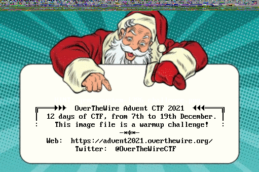

## Overview

We're given a PNG, but after some investigation, we find it's not _just_ a PNG. It's a bootable drive that runs 16-bit x86 code. The program it runs is a christmas quiz that works by modifying it's own PNG data to display questions and answers. To get the flag you need to answer all the questions correctly.

Which is nuts, completely crazy, never seen anything like it. It's a really beautiful challenge.

## Writeup

### Identifying Polyglots

Even at first glance, you see something is wrong. I see a picture of Santa and the details for Advent OverTheWire 2021, but the top of the image looks like it's being eaten... [by some Linux or something...](https://www.youtube.com/watch?v=Az49aNuYeJs)

Checking `file` and a hexdump:

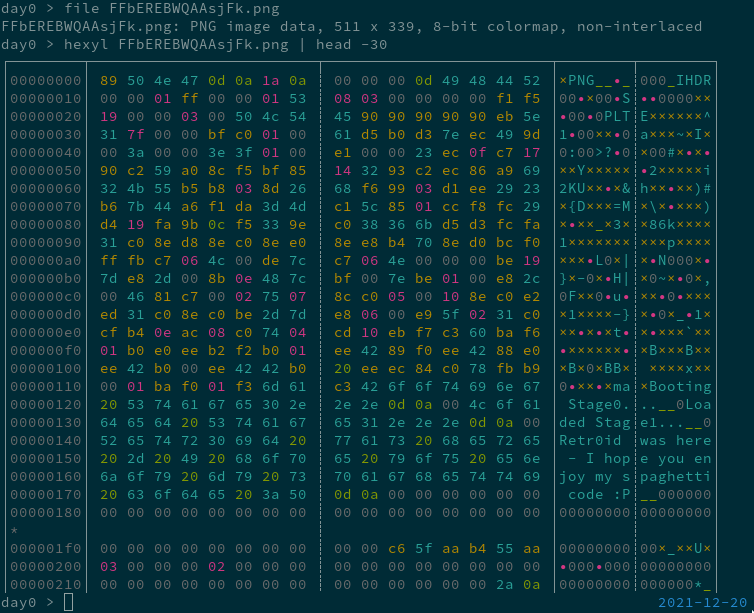

A PNG with an 8-bit colormap, hence the palette (`PLTE`) header. A normal PNG with an 8 bit colormap would use the next 0x300 bytes after `PLTE` to specify the R,B, and G values for 0x100 pixels of a custom palette.  

But is "Booting Stage0... Loaded Stage1... Retr0id was here - I hope you like my spaghetti code :P" really supposed to be specifing colors? And the repeated `0x90`s at the start of the `PLTE` header, looks a bit like a NOP sled... Wait, is that 0xaa55 at offset 0x1fe? [I've seen that before...](/ctfs/2021-adversary-quest/proclaimation/)

According to `file`, my web browser, your web browser, and the twitter uploading form, this is a valid PNG file. But is that _all_ it is? Polyglot files are files that are two filetypes at the same time, say a PDF _and_ a ZIP file. And Retr0id has been known to make [PNG polyglots](https://github.com/DavidBuchanan314/tweetable-polyglot-png) before. 


```
> file --keep-going FFbEREBWQAAsjFk.png | sed 's/\\012- /\n/g'
FFbEREBWQAAsjFk.png: PNG image data, 511 x 339, 8-bit colormap, non-interlaced
DOS/MBR boot sector
 DOS/MBR boot sector
data
```

Yep, it's a polyglot!

It's not _just_ a PNG, its a PNG that is also a bootable drive! 

### Initial Boot

Let's boot it up with QEMU:

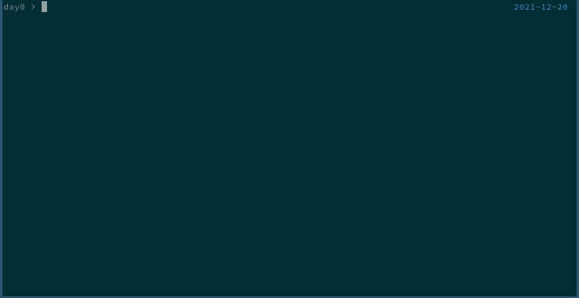

Wow that's insane! How does it do that?

When a computer boots, the BIOS looks for a bootable drive. Drives are marked as bootable by having the magic bytes `0xaa55` at the offset `0x1fe`, or 510 bytes in. If the BIOS finds one, it loads up the first sector of the drive (the boot sector) at the address `0x7c00`, points the instruction pointer to the start, and just starts executing x86 instructions.

Tthe processor starts running these instructions in [Real Mode](https://en.wikipedia.org/wiki/Real_mode):
> an operating mode that all x86 CPUs support. ...

> There is no memory protection, multitasking, or code privilege levels. ...

> for backward compatibility, all x86 CPUs start in real mode when reset

And talk about backward compatibility: Real Mode was the only mode available in the 8086 chip, released in 1979 (!) and used in the original IBM PC. Protected Mode, with virtual memory and basic privilege levels, was released with the 80286 in 1982, but you had to _switch into_ Protected Mode. To this day, CPUs still start in Real Mode. 

[This article](https://github.com/angea/pocorgtfo/blob/master/contents/articles/04-03.pdf) from POC||GTFO is a great overview of Real Mode and how OSes bot (and the [follow up](https://github.com/angea/pocorgtfo/blob/master/contents/articles/05-06.pdf) is great too).

So when the PNG boots, this is what the CPU, in "Real Mode", sees:

```
> objdump -M intel -D -b binary -mi386 -Maddr16,data16 FFbEREBWQAAsjFk.png 

FFbEREBWQAAsjFk.png:     file format binary


Disassembly of section .data:

00000000 <.data>:
       0:       89 50 4e                mov    WORD PTR [bx+si+0x4e],dx
       3:       47                      inc    di
       4:       0d 0a 1a                or     ax,0x1a0a
       7:       0a 00                   or     al,BYTE PTR [bx+si]
       9:       00 00                   add    BYTE PTR [bx+si],al
       b:       0d 49 48                or     ax,0x4849
       e:       44                      inc    sp
       f:       52                      push   dx
      10:       00 00                   add    BYTE PTR [bx+si],al
      12:       01 ff                   add    di,di
      14:       00 00                   add    BYTE PTR [bx+si],al
      16:       01 53 08                add    WORD PTR [bp+di+0x8],dx
      19:       03 00                   add    ax,WORD PTR [bx+si]
      1b:       00 00                   add    BYTE PTR [bx+si],al
      1d:       00 f1                   add    cl,dh
      1f:       f5                      cmc    
      20:       19 00                   sbb    WORD PTR [bx+si],ax
      22:       00 03                   add    BYTE PTR [bp+di],al
      24:       00 50 4c                add    BYTE PTR [bx+si+0x4c],dl
      27:       54                      push   sp
      28:       45                      inc    bp
      29:       90                      nop
      2a:       90                      nop
      2b:       90                      nop
      2c:       90                      nop
      2d:       90                      nop
      2e:       eb 5e                   jmp    0x8e
      30:       31 7f 00                xor    WORD PTR [bx+0x0],di
```

So it's ugly, and it doesn't do anything, but this PNG header is valid x86 code, and can be run without error by an x86 CPU.

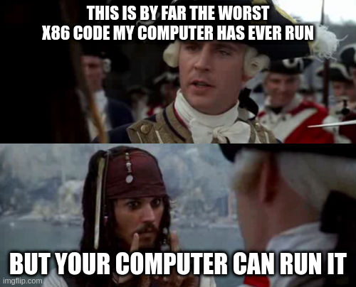

Soon after the `PLTE` header (`50 4c 54 45`), when arbitrary bytes can be written while still being a valid PNG, Santa has a NOPs sleigh and a rooftop `jmp 0x8e` to: 

```
      86:       33 9e c0 38             xor    bx,WORD PTR [bp+0x38c0]
      8a:       36 6b d5 d3             ss imul dx,bp,0xffd3
      8e:       fc                      cld    
      8f:       fa                      cli    
      90:       31 c0                   xor    ax,ax
      92:       8e d8                   mov    ds,ax
      94:       8e c0                   mov    es,ax
      96:       8e e0                   mov    fs,ax
      98:       8e e8                   mov    gs,ax
      9a:       b4 70                   mov    ah,0x70
      9c:       8e d0                   mov    ss,ax
      9e:       bc f0 ff                mov    sp,0xfff0
      a1:       fb                      sti    
      a2:       c7 06 4c 00 de 7c       mov    WORD PTR ds:0x4c,0x7cde
      a8:       c7 06 4e 00 00 00       mov    WORD PTR ds:0x4e,0x0
      ae:       be 19 7d                mov    si,0x7d19
      b1:       e8 2d 00                call   0xe1
      b4:       8b 0e 48 7c             mov    cx,WORD PTR ds:0x7c48
      b8:       bf 00 7e                mov    di,0x7e00
      bb:       be 01 00                mov    si,0x1
      be:       e8 2c 00                call   0xed
```

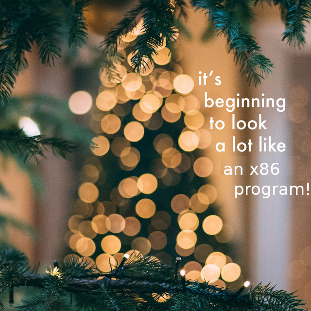

### First bites of spaghetti

To debug this, you can run QEMU with the flags `-S -s` to stop execution at startup and run a GDB server on port 1234.

```
> qemu-system-i386 -S -s -drive file=FFbEREBWQAAsjFk.png
```
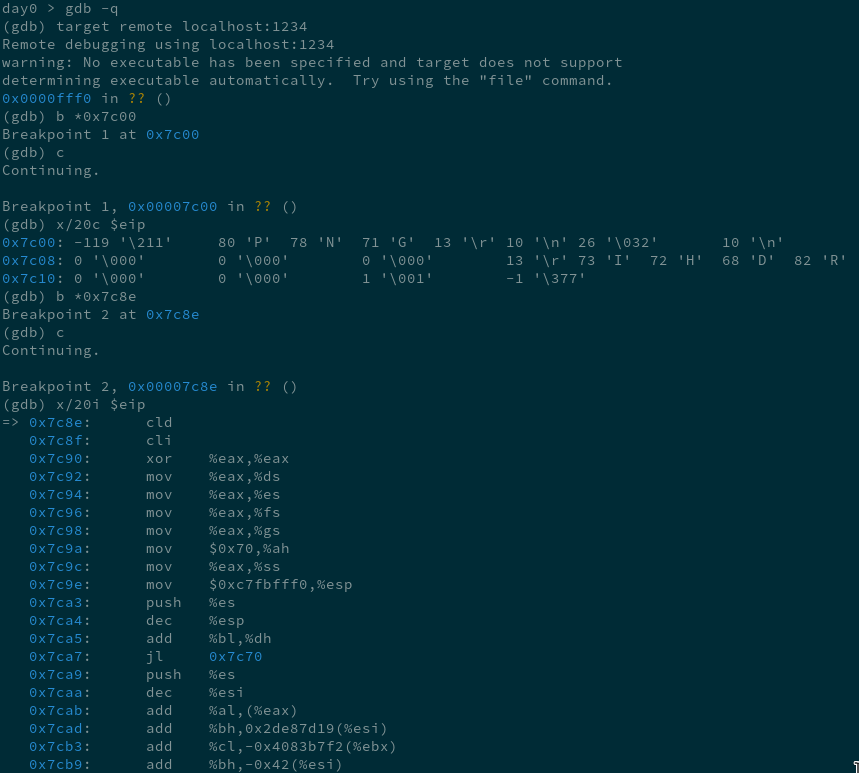

Which works, except when it doesn't. GDB sometimes has a hard time understanding 16 bit x86 instructions, even after running `set architecture i8086` (though for GDB servers in QEMU, apparently there are a [couple more steps](https://stackoverflow.com/questions/32955887/how-to-disassemble-16-bit-x86-boot-sector-code-in-gdb-with-x-i-pc-it-gets-tr/55246894#55246894) I didn't know about). In the past I used [this gdb script](https://ternet.fr/gdb_real_mode.html) to better show memory layout, but it still doesn't disassemble the code correctly.

It is pretty annoying to jump back and forth between gdb and objdump so this time I ended up using radare2, which had no problems decoding 16 bit assembly and interfaced seamlessly with the GDB server. Lets take a look at the start of the program:

```
> cat debug.r2
e asm.bits=16
e dbg.bpinmaps=false
db 0x7c8e
db 0x7f60
> r2 -i debug.r2 -b 16 -d gdb://localhost:1234
```

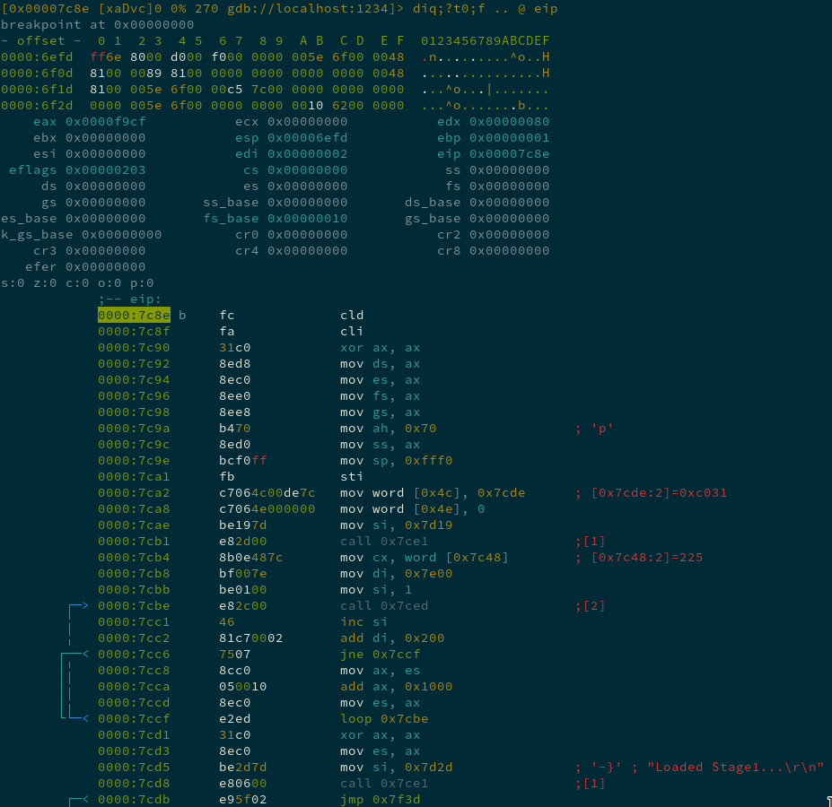

We're still just dealing with the first 512 bytes of the PNG, the boot sector part of the file. The loop in the above code, that repeatedly calls `0x7ced`, loads in the rest of the file using the `IN` and `OUT` instructions ([this](https://stackoverflow.com/questions/3215878/what-are-in-out-instructions-in-x86-used-for) was an interesting overview of early CPU I/O). 

There are also two calls to `0x7ce1`, a simple function that prints a string to the display using the [int 0x10](https://en.wikipedia.org/wiki/INT_10H) BIOS interrupt.

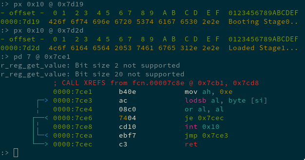


At this point it was my second time running the image file, the first time in a debugger, and I had no idea what surprises the [spaghett](https://www.youtube.com/watch?v=Omy3BERUd1g) code had in store. 


### Getting spooked

The program then jumps to `0x7f3d`, after the 0x300 bytes of PNG's `PLTE` chunk, to the start of the `IDAT` chunk. So all the following code being run is the pixels you can actually _see_ on the top of the original file. 

At this point I realized I'd get nowhere if I keep single-stepping through the binary. So I started stepping over function calls, moving a bit quicker, and seeing what changes in the output until I found something interesting.


The arguments to the print function (`0x7ce1`) give us some overview. The program calls a function `0x81ef` that initialize a quiz. If that function doesn't return 0, it then endlessly loops, printing "Someone touched my spaghett!".

If the call does return successfully, it prints a bunch of newline characters ("\n" or `0x0a`) and calls `0x83d9`, which prints the beautiful splash screen.

It then waits for user input with the keyboard interrupt [int 0x16](https://en.wikipedia.org/wiki/INT_16H), calls what I assume are more initialization functions, and then branches depending on what value is stored in the memory location `0x7e04`.

Moving even quicker, stepping over function calls, jumping all over the place, just looking for changes in the boot screen, we find that the call to `0x82db` blocks, with the program now requesting input.

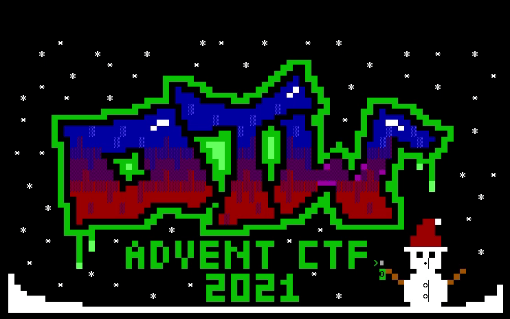

Huh. Requesting input without any prompting is class crackme behavior, which is good because we now have a goal: all we have to do is find out what the correct input is and then we'll get the flag, right?

But wait, it wasn't prompting for input the first time we ran it. And during subsequent debugging sessions where I was moving a bit slower, hoping to see where the input was stored and how it was checked, I was never asked for input again. What is going on?

I only realized a couple days later, when when I pulled up the bootable image to show a friend, and it was not the same one I remembered. It looked something like:


```
day0 > mv FFbEREBWQAAsjFk.png wrong.png
day0 > wget --quiet https://pbs.twimg.com/media/FFbEREBWQAAsjFk.png
SSL_INIT
day0 > md5sum FFbEREBWQAAsjFk.png wrong.png
3ec59e440409dabc847841c5c6e9adaf  FFbEREBWQAAsjFk.png
a879b7ce54a38fb1e85e8a706329f716  wrong.png
```


### Quiz time

So the image actually changes when we run it! Lets redownload the original and try running it a few times to see how it changes.

```
day0 > qemu-system-x86_64 -drive format=raw,file=FFbEREBWQAAsjFk.png
day0 > display FFbEREBWQAAsjFk.png
```


```
day0 > qemu-system-x86_64 -drive format=raw,file=FFbEREBWQAAsjFk.png
```
I get prompted for input, where I answer a bit indecisively, and then:
```
day0 > display FFbEREBWQAAsjFk.png
```

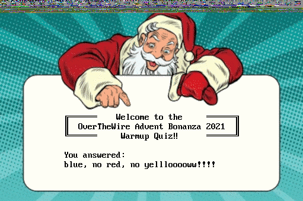

And again:

```
day0 > qemu-system-x86_64 -drive format=raw,file=FFbEREBWQAAsjFk.png
day0 > display FFbEREBWQAAsjFk.png
```


So now we actually know the full scope of the challenge. We have to correctly answer the 8 questions of the warmup quiz to get the flag.

But, c'mon man, do we really need to answer all 8 question? We have debugging capability, can't we just find the answer-checking code, and no matter the input, force the checker to return true? Even better, can't we just find the flag-printing code and run it directly?


If only it were that easy...


### Checking the checker


Here are the same initialization functions as above. You can see the function call `0x81ef` that (I assume) checks the integrity, and if false, will endless loop, printing "Someone touched my spaghett!" You can also see the call to `0x82db`, the "Provide input" function, happens if the value at `0x7e04` is 1. And after calling it, it changes it to 2.

Looking at the broader control flow of the main function using radare2's visual graph mode:

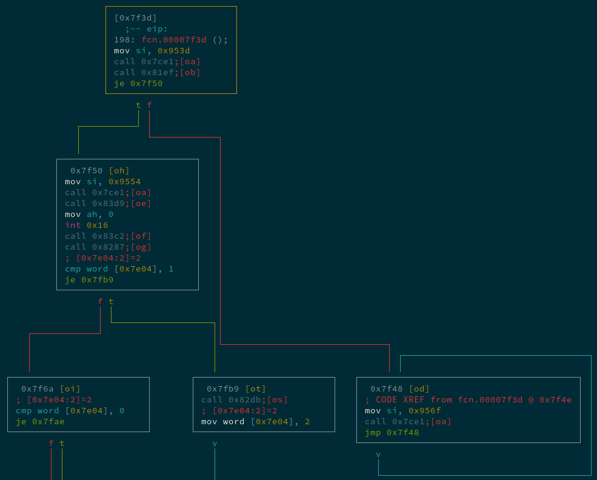

The "Initializing Quiz" (`call 0x81ef`) is up top, the infinite loop printing "Somone touched my spaghett!" happens if it fails, and the call to the "Provide Input" function (`call 0x82db`) is in the middle.

It looks like the value at `0x7e04` is important - it stores the "state" of the quiz. If `0x7e04` is set to 1 then the PNG has a quiz question displayed and on the next run the bootable code asks for the answer with "Provide input:", setting `0x7e04` to 2.

And if this "state" value is set to 2, then the PNG has "You answered:" displayed on it. And when running the code with a state of "2", it checks to see if the answer is correct.

So this must be that "checking" functionality:

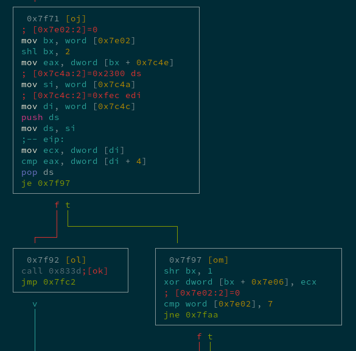

The value at `0x7e02` stores the current "question number". So the above code grabs 4 bytes (a `dword`) from the array starting at `0x7c4e` at the index of the question number, and stores it in `eax`.

This value is the "correct answer" for the current question, because it ends up `cmp`aring it to `[di+4]`, which (after some Real Mode memory addressing weirdness) points to the [CRC](https://en.wikipedia.org/wiki/Cyclic_redundancy_check) at the end of the `IDAT` [chunk](https://www.w3.org/TR/PNG-Structure.html) just before the start of the `IEND` footer: 

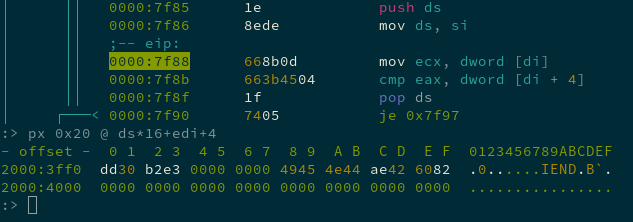

So after updating the image with the "You answered:" message and running it again, the program checks if it's the right answer by reusing _the same integrity check as the PNG specification itself_, (the CRC), to compare it to a correct value.

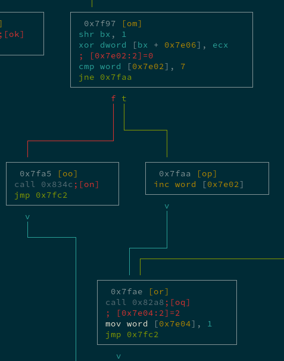

If the comparison succeeds, another value (`[di]`) is XORed at an array starting at `0x7e06`. If the current question number is 7, then presumably our flag printing function (`0x834c`) is called. If not, the "question number" (`0x7e02`) is incremented, the "state" (`0x7e04`) is changed to "printing a question" (1), and the program goes on to print the next question, save to disk, and exit.

### Santa wants milk and cookies, not cheese!

"Okay this is cute and all, but cut the crap, lets jump to that flag printing function and see the flag"

Naturally that's the first thing I did after identifying it, but after running it, you don't get a valid image back - it's mostly filled with null-bytes and some garbage. Checking the flag printing function with radare2's ghidra decompiler (which I didn't even know would work in real mode until doing this write-up):

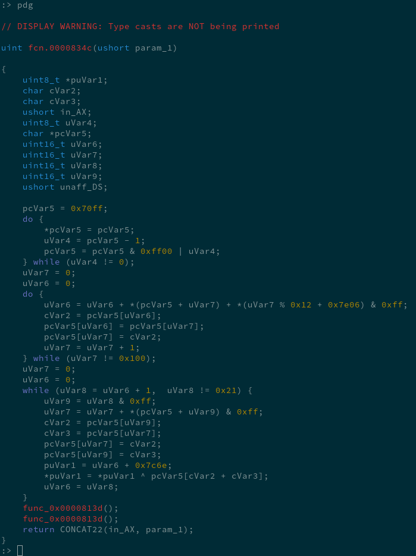

The first do...while loop here makes a 0x100 long array of bytes `0x00, 0x01, 0x02 ... 0xfe, 0xff`. Searching for "0x100 bytes encryption" and it looks like the flag is encrypted with RC4, with the encrypted flag located at `0x7c6e`, and the key at `0x7e06`. The key is generated above, from the values at `[di]` across all 8 correct answers to the quiz.

To me, this was the real beauty of this challenge. At the beginning it was astonishing that a PNG file could run a program, a Christmas quiz, when booted as a hard disk. Near the end, it was astonishing that you actually _have_ to answer all the questions to get the flag.

So lets answer them! (It took me an embarssingly long time to realize that it is _Santa_ asking the questions)


> Red


> Rudolph

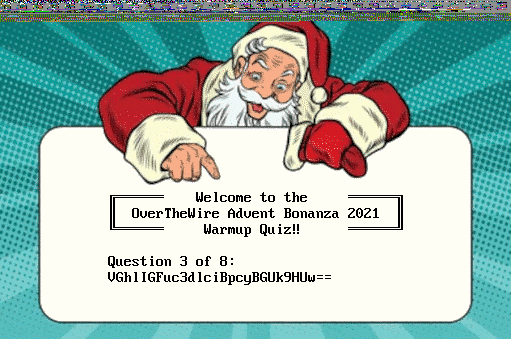

(base64 decoded to: "The answer is FROGS")

> FROGS


(ROT13 for "What is this cipher called?")

> ROT13

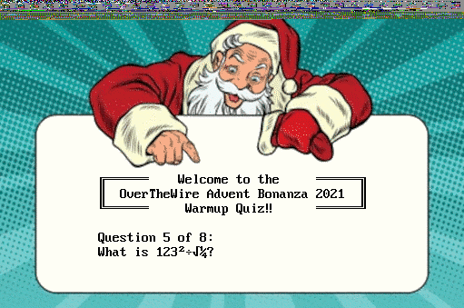

> 30258


> RC4


Well, crap. I was breezing through it up until this point. But I searched google and it turns out Santa _traditionally_ does not have a favorite 7 digit prime. We might have to brute force this one.

### Brute force on Quizmas Eve

48 hours before the CTF ended and almost all of the challenges released, I took stock of flags I could try to pick up before time and started working on this warmup challenge again. Around 8 hours before time, I got to this point, where I realized I needed to brute force the last few questions. It had been dark outside for a while and I was fading fast.

There are over half a million 7 digit primes. And question 8 is "What’s my password? (Hint: rockyou)", which has tens of millions.

I patched together a very ugly script to brute force the 7-digit prime using the qemu monitor, sending individual keys using the `sendkey` command: 

```python
#!/usr/bin/env python3
import os
import sys

if len(sys.argv) != 3:
    print("usage: ./brute [input.png] [list.txt]")
    exit(1)
    
# extracted from offset 0x66 of the png
# or 0x7c4e+4*6 in the binary
target = bytes([0x8d, 0x26, 0x68, 0xf6]) 

with open(sys.argv[2]) as f:
    list = f.readlines()

cmd = "mkdir imgs2"
print(cmd)
os.system(cmd)

for l in list:
    filename = "imgs2/" + l.strip() + ".png"
    cmd = "cp " + sys.argv[1] + " " + filename 
    os.system(cmd)
    print(cmd)
    cmd = "qemu-system-i386 -display none -daemonize --monitor unix:santa_socket,server,nowait -drive format=raw,file=" + filename
    print(cmd)
    os.system(cmd)
    cmd = "./sendkeys/sendkeys \"<ret>" + l.strip() + "<ret><ret>\" | socat - unix-connect:santa_socket"
    print(cmd)
    os.system(cmd)
    with open(filename, "rb") as f:
        f.seek(0x1c3f0) # offset of final crc
        crc = f.read(4)
        if crc == target:
            print("FOUND SANTAS FAVORITE PRIME!!!")
            print(l)
            exit(0)
        else:
            cmd = "rm " + filename
            print(cmd)
            os.system(cmd)
```

This method turned out to be very slow. About 1 guess a second. I broke the list of primes into 10 lists and ran them all in parallel. While that was churning away, I recognized I probably couldn't do rockyou to get Santa's password the same way in time.

But if I brute force the answer to question 7, I should have 14 bytes of the 18 byte long key. And cracking the remaining 2^32 bits wouldn't be fast, but would certainly be faster than running rockyou through my existing script. Here was my cracking program written in go:

```go
package main

import (
	"fmt"
	"crypto/rc4"
)

func main() {
	ciphertext := []byte{
		0x29,0x23,0xb6,0x7b,0x44,0xa6,0xf1,0xda,
        0x3d,0x4d,0xc1,0x5c,0x85,0x01,0xcc,0xf8,
        0xfc,0x29,0xd4,0x19,0xfa,0x9b,0x0c,0xf5,
        0x33,0x9e,0xc0,0x38,0x36,0x6b,0xd5,0xd3}
	key_prefix := []byte{
		0x0f,0x53,0x9a,0x42,
		0x3a,0xf9,0xfe,0x19,
		0x0c,0xdd,0x1f,0xcb,
        // Didn't know these last two bytes when I wrote this
		0x09,0x9c}
	
	fmt.Println(key_prefix)
	fmt.Println(ciphertext)
	count := 0	
	// this is ugly i know I'm moving fast but let me tell you
	// it is great practice for vim keybinds.
	for i := 0; i < 256; i ++ {
		for j := 0; j < 256; j ++ {
			for k := 0; k < 256; k ++ {
				for l := 0; l < 256; l ++ {
					key := append(key_prefix, byte(i), byte(j), byte(k), byte(l))
					cipher, _ := rc4.NewCipher(key)
					out := make([]byte, 0x20)
					cipher.XORKeyStream(out, ciphertext)
					if count % 1000000 == 0 {
						fmt.Println(count, "trying key:", key)
						fmt.Println("with output", out)
					}
					count ++
					if out[0] == 'A' && out[1] == 'O' && out[2] == 'T' && out[3] == 'W' && out[4] == '{' {
						fmt.Println("FOUND FLAG!!!!!")
						fmt.Printf("out: %s\n", out)
						return
					}
				}
			}
		}
	}
}
```

I had about 6 hours left. The 10 parallel qemu bruteforcing was going very slow. A quick calculation showed I had about 1/5 chance of guessing Santa's favorite 7 digit prime.

I needed a Christmas miracle. I'd been nice this year, right? Before going to sleep, I made sure to leave my browser cookies out. And I woke up early in the morning hoping Santa would leave a flag for me under the Christmas spanning tree.

Final runtime:

```
QEMU 6.1.0 monitor - type 'help' for more information
(qemu) sendkey ret
(qemu) sendkey 3
(qemu) sendkey 1
(qemu) sendkey 3
(qemu) sendkey 3
(qemu) sendkey 3
(qemu) sendkey 3
(qemu) sendkey 7
(qemu) sendkey ret
(qemu) sendkey ret
(qemu) FOUND SANTAS FAVORITE PRIME!!!
3133337                                                                                                  
./brute.py q7.png xac  2540.02s user 471.96s system 5% cpu 13:57:10.44 total
```

And cracking the key to get the flag:

```
2218000000 trying key: [15 83 154 66 58 249 254 25 12 221 31 203 9 156 132 51 254 128]
with output [203 152 41 235 222 253 17 244 32 186 152 153 183 85 191 61 204 12 252 31 32 245 69 132 173 128 206 32 169 116 97 40]
FOUND FLAG!!!!!
out: AOTW{u_4r3_th3_xm45_qu1zm4st3r}
go run crack2.go  7549.51s user 188.92s system 104% cpu 2:02:51.74 total
```

16 hours total. Not even close.

I don't actually even celebrate Christmas. I'm Jewish. 