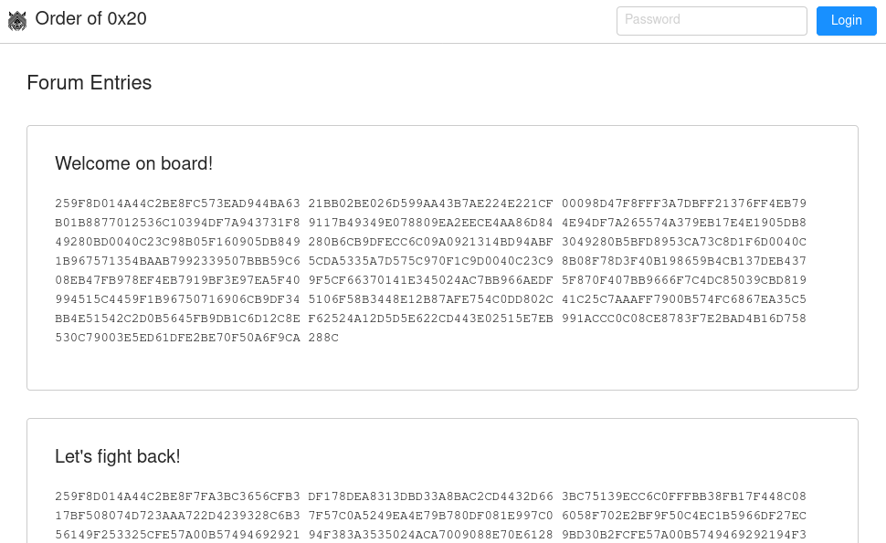

#### Challenge Description:

> With the help of your analysis, we got onto the trail of the group and found their hidden forum on the Deep Dark Web. Unfortunately, all messages are encrypted. While we believe that we have found their encryption tool, we are unsure how to decrypt these messages. Can you assist?


#### Write-Up:

We are given [crypter.py](crypter.py.txt), a semi-obfuscated python script and a bunch of encrypted text on the darkweb forum.



Looking at the encryption script, it takes 2 additional arguments, an "E" or some other character and a `K`ey of length 9. It takes a `M`essage from standard input and runs it through the main function `C()`. When `E`ncrypting, it concatenates the message with `"SPACEARMY"` and runs the key through some sort of key reversal function `U()`. When decrypting, it just uses the inputted key and checks for the `"SPACEARMY"` at the beginning.


```Python
len(sys.argv) == 3 or die('FOOL')
K=bytes(sys.argv[2], 'ascii')
len(K)==9 and T(*K)&1 or die('INVALID')
M=sys.stdin.read()
if sys.argv[1].upper() == 'E':
    M=B'SPACEARMY'+bytes(M,'ascii')
    print(C(U(K),M).hex().upper())
else:
    M=C(K,bytes.fromhex(M))
    M[:9]==B'SPACEARMY' or die('INVALID')
    print(M[9:].decode('ascii'))
```

At first look the functions `U()`, `C()`, and `T()` seemed bizzare, even after parsing all the `lambda`s, `zip`s, and `*`s. The math has some patterns and structure to it but understanding what it meant was the bulk of the challenge. `"SPACEARMY"` starts every encrypted message and in our ciphertext, all posts with the same 9 bytes: `259F8D014A44C2BE8F`. Our key is 9 bytes long and the `B` lambda function seems to encrypt 9 bytes at a time. So can we use our known plaintext and ciphertext together to recover the key?  

```Python
T=lambda A,B,C,D,E,F,G,H,I:A*E*I+B*F*G+C*D*H-G*E*C-H*F*A-I*D*B&255
def U(K):
    R=pow(T(*K),-1,256)
    A,B,C,D,E,F,G,H,I=K
    return [R*V%256 for V in
     [E*I-F*H,C*H-B*I,B*F-C*E,F*G-D*I,A*I-C*G,C*D-A*F,D*H-E*G,B*G-A*H,A*E-B*D]]
def C(K,M):
    B=lambda A,B,C,D,E,F,G,H,I,X,Y,Z:bytes((A*X+B*Y+C*Z&0xFF,
        D*X+E*Y+F*Z&0xFF,G*X+H*Y+I*Z&0xFF))
    N=len(M)
    R=N%3
    R=R and 3-R
    M=M+R*B'\0'
    return B''.join(B(*K,*W) for W in zip(*[iter(M)]*3)).rstrip(B'\0')
```

For me, the lambda functions `T`, `B` looked familiar and led me to the encryption mechanism but in retrospect the name of the challenge is the biggest hint. `B` is used in `C()` to do [matrix multiplication](https://en.wikipedia.org/wiki/Matrix_multiplication) of the key and the message, both thought of as a 3x3 matrix. `T` takes the [descriminate](https://en.wikipedia.org/wiki/Discriminant) of the key matrix, which is used to find the [inverse matrix](https://en.wikipedia.org/wiki/Invertible_matrix) in `U()` to turn the decryption key into an encryption key.

So if decryption looks like: 

```
  ciphertext  x     key     =  plaintext             
  _        _     _       _     _       _
 |          |   |         |   |         |
 | 25 9F 8D |   | K  2  A |   | S  P  A |
 |          |   |         |   |         |
 | 01 4A 44 | x | E  C  C | = | C  E  A |
 |          |   |         |   |         |
 | C2 BE 8F |   | Y  R  K |   | R  M  Y |
 |_        _|   |_       _|   |_       _|
 ```
Then we can recover the key by left multiplying the equation by the inverse of the ciphertext, all mod 256:

```
           -1
  ciphertext  x  plaintext  =     key
  _        _     _       _     _       _
 |          |   |         |   |         |
 | e2 4b c6 |   | S  P  A |   | S  P  4 |
 |          |   |         |   |         |
 | a7 cf e7 | x | C  E  A | = | e  v  a |
 |          |   |         |   |         |
 | 96 f8 cd |   | R  M  Y |   | C  E  S |
 |_        _|   |_       _|   |_       _|
 ```

Decrypting the messages from the message board:

```
$ python crypter.py D SP4evaCES
259F8D014A44C2BE8FC573EAD944BA63 21BB02BE026D599AA43B7AE224E221CF
00098D47F8FFF3A7DBFF21376FF4EB79 B01B8877012536C10394DF7A943731F8
9117B49349E078809EA2EECE4AA86D84 4E94DF7A265574A379EB17E4E1905DB8
49280BD0040C23C98B05F160905DB849 280B6CB9DFECC6C09A0921314BD94ABF
3049280B5BFD8953CA73C8D1F6D0040C 1B967571354BAAB7992339507BBB59C6
5CDA5335A7D575C970F1C9D0040C23C9 8B08F78D3F40B198659B4CB137DEB437
08EB47FB978EF4EB7919BF3E97EA5F40 9F5CF66370141E345024AC7BB966AEDF
5F870F407BB9666F7C4DC85039CBD819 994515C4459F1B96750716906CB9DF34
5106F58B3448E12B87AFE754C0DD802C 41C25C7AAAFF7900B574FC6867EA35C5
BB4E51542C2D0B5645FB9DB1C6D12C8E F62524A12D5D5E622CD443E02515E7EB
991ACCC0C08CE8783F7E2BAD4B16D758 530C79003E5ED61DFE2BE70F50A6F9CA 288C 
Welcome on board and congratulations on joining the Order of 0x20.

Together we will fight the good fight and bring enlightenment to the
non-believers: Let's stop the global TAB infestation once and for all.
This forum is a place to share news and coordinate action, but be
careful: you never know who's watching.

 040 == 32 == 0x20

-- admin.

$ python crypter.py D SP4evaCES
259F8D014A44C2BE8F7FA3BC3656CFB3 DF178DEA8313DBD33A8BAC2CD4432D66
3BC75139ECC6C0FFFBB38FB17F448C08 17BF508074D723AAA722D4239328C6B3
7F57C0A5249EA4E79B780DF081E997C0 6058F702E2BF9F50C4EC1B5966DF27EC
56149F253325CFE57A00B57494692921 94F383A3535024ACA7009088E70E6128
9BD30B2FCFE57A00B5749469292194F3 83A3533BAB08CA7FD9DC778386803149
280BE0895C0984C6DC77838C2085B10B 3ED0040C3759B05029F8085EDBE26DE3
DF25AA87CE0BBBD1169B780D1BCAA097 9A6412CCBE5B68BD2FB780C5DBA34137
C102DBE48D3F0AE471B77387E7FA8BEC 305671785D725930C3E1D05B8BD884C0
A5246EF0BF468E332E0E70009CCCB4C2 ED84137DB4C2EDE078807E1616AA9A7F
4055844821AB16F842 
My name is rudi. i was fired by my Old employer because I refused
to use TABs. THIS madness must be STOPPED! These people must be
STOPPED!1! But I fought back! I hacked their network established
access. Let me know if you have an idea how to take revegne!

 040 == 32 == 0x20

-- rudi.

$ python crypter.py D SP4evaCES
 259F8D014A44C2BE8FC50A5A2C1EF0C1 3D7F2E0E70009CCCB4C2ED84137DB4C2
 EDE078807E1616C266D5A15DC6DDB60E 4B7337E851E739A61EED83D2E06D6184
 11DF61222EED83D2E06D612C8EB5294B CD4954E0855F4D71D0F06D05EE 
Good job!

 040 == 32 == 0x20

CS{if_computers_could_think_would_they_like_spaces?}
```